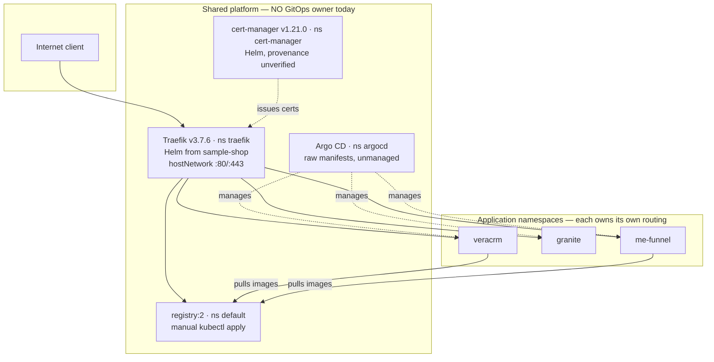
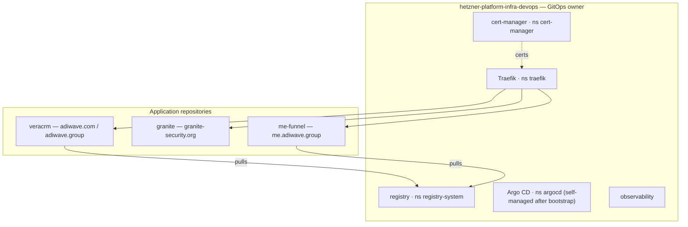

# Hetzner Platform — architecture and ownership

**Status:** discovery complete. **Nothing has been deployed, renamed, migrated or transferred.**
**Verified:** 2026-07-30 · **Cluster:** `kubernetes-admin@cluster.local` · read-only `kubectl`

This repository is the **designated future** authoritative GitOps source for Kubernetes and Hetzner
platform components shared by more than one application namespace. **It owns no live components yet**;
§5 defines the staged ownership-transfer plan.

---

## 1. Discovery report — verified vs inferred

Everything in this section was read from the live cluster. Where something could not be verified from
the cluster, it says so.

### 1.1 The cluster is genuinely multi-tenant

Twelve Argo CD Applications: **six sourced from three identified application repositories, plus six
multi-source or chart-based observability Applications** that declare no single `repoURL`.

| Application(s) | Source repository | Path |
|---|---|---|
| `veracrm`, `veracrm-platform`, `veracrm-observability`, `infra-vault` | `adiwavegroup/vera` | `infra/k8s`, `infra/platform`, `infra/observability`, `infra/vault` |
| `granite` | `Granite-Security/sample-shop` | `k8s/hetzner/app-multi` |
| `me-funnel` | `listellodavide/girl-dates-invitation-funnel` | `infra/k8s` |
| six `observability-*` | *(no single `repoURL` — multi-source or chart-based)* | — |

Namespaces: `argocd`, `cert-manager`, `default`, `granite`, `infra-global-observability`,
`infra-vault`, `local-path-storage`, `me-funnel`, `rook-ceph`, `traefik`, `veracrm`, plus `kube-*`.

### 1.2 Core shared platform components are outside GitOps

Verified: **Traefik, cert-manager, the private registry, and Argo CD itself are not managed by any
Argo CD Application.** Traefik and cert-manager were installed through Helm outside GitOps, the
registry was applied manually, and Argo CD was installed from raw manifests without self-management.

Shared observability **is** already represented by Argo CD Applications, but its source ownership and
provenance still require verification — so "outside GitOps" is a claim about these four components,
not about the whole platform layer.

| Component | Install method | Namespace | Version | ArgoCD |
|---|---|---|---|---|
| Traefik | Helm release `traefik` | **`traefik`** | `docker.io/traefik:v3.7.6` | ✗ |
| cert-manager | Helm release `cert-manager` | `cert-manager` | `v1.21.0` | ✗ |
| Registry | **manual `kubectl apply`** | **`default`** | `registry:2` (unpinned) | ✗ |
| Argo CD | **raw manifests, not Helm** | `argocd` | — | ✗ (does not manage itself) |

### 1.3 Corrections to assumptions in the brief

Three beliefs did not survive verification:

- **The registry is `registry.adiwave.com`, not `registry.adiwave.group`.** `.com` resolves to
  `88.99.149.31` and returns `401` (auth working). `.group` **does not resolve at all**.
- **Traefik is in namespace `traefik`** — not `traefik-system`, and not `kube-system` (which I had
  previously stated incorrectly myself).
- **The live registry differs from the supplied YAML** — see §1.5. Rebuilding from that YAML would
  break it.

### 1.4 Traefik — the undeclared cross-project dependency

```
sample-shop repository
  └── Helm-installs Traefik (hostNetwork, :80/:443, providers.kubernetesGateway)
        └── creates GatewayClass "traefik" (controller traefik.io/gateway-controller)
              └── programs Gateway/veracrm-gateway, granite-gateway, me-gateway, registry-gateway
                    └── serves every public hostname on this cluster
```

So VeraCRM, Granite Security, me-funnel and the registry all depend on a controller installed from an
unrelated application repository. A change or uninstall there alters or removes every public endpoint,
and **no review in any consuming repository would see it**.

`forwardedHeaders.trustedIPs` is **unset**, which is also why the Cloudflare client-IP prerequisite is
not actionable from any application repo.

### 1.5 Registry — live state vs the supplied YAML

| | Supplied YAML | Live | Consequence |
|---|---|---|---|
| Namespace | *(none declared)* | `default` | YAML would land in `default` — matches by accident |
| `REGISTRY_HTTP_TLS_CERTIFICATE` | set | **absent** | registry serves **plain HTTP** |
| `REGISTRY_HTTP_TLS_KEY` | set | **absent** | TLS terminates at Traefik instead |
| `tls` volume (`registry-tls`) | mounted | **still mounted, unused** | vestigial |
| Service | NodePort 30500 | NodePort 30500 | matches |
| PV | 200Gi, `Retain`, `/mnt/registry` | same, `Bound` | matches |
| Image | `registry:2` | `registry:2` | unpinned tag; digest not recorded |

> **Reconstructing the registry from the supplied YAML would re-enable in-pod TLS and break it.** The
> live state is the source of truth for the transfer, not the file.

Public path: `registry.adiwave.com` → `Gateway/registry-gateway` (cert `registry-adiwave-com-tls`) →
`registry-service`. NodePort 30500 also remains reachable on the node — two entry paths.

Consumers verified from live image references: **`veracrm`** and **`me-funnel`** namespaces.

Storage: `hostPath /mnt/registry` pins the workload to this node, is not replicated, and has no
verified backup. `REGISTRY_STORAGE_DELETE_ENABLED=true` with no garbage-collection history found.

### 1.6 Argo CD — the bootstrap gap

Argo CD is installed from raw manifests (zero Helm release secrets in `argocd`) and **no Application
manages it**. It cannot be the only mechanism that installs itself, so the target is a version-pinned
bootstrap step followed by an `argocd-platform` Application owning configuration and upgrades. The
namespace stays `argocd`.

---

## 2. Ownership rule

> **Infrastructure used by more than one application namespace belongs to this repository.**
> Applications own their workloads, namespace-scoped routing, hostnames and event contracts.

Traefik must become a **neutral platform component**, not VeraCRM's. It serves Granite Security and
me-funnel too, and moving it into any one application repository would only relocate the problem —
Granite would then depend on VeraCRM.

The reviewed ownership metadata is [`infrastructure-ownership.yaml`](infrastructure-ownership.yaml).
A generator can discover a controller; it cannot discover which repository owns it, so that fact is
maintained by hand and reviewed.

---

## 3. Current architecture



## 4. Target architecture

> **Status:** accepted direction; **nothing implemented**.



Namespaces stay as they are for the **first** transfer. `registry-system` and any other renaming is a
later, separate change — the first migration preserves behaviour and identity, nothing else.

---

## 5. Migration — staged, one component per PR

**No PR may create simultaneous reconciliation of the same live resources from two repositories or
two Argo CD Applications.**

| # | PR | Rollback boundary |
|---|---|---|
| 1 | Architecture and live inventory *(this PR)* | docs only |
| 2 | Argo CD ownership + bootstrap design | no live change |
| 3 | Traefik ownership transfer | revert Application, sample-shop resumes |
| 4 | Registry ownership transfer, **no redesign** | revert Application, manual YAML resumes |
| 5 | cert-manager ownership verification/transfer | as above |
| 6 | Observability ownership | as above |
| 7 | Registry hardening and exposure redesign | independent |
| 8 | Cleanup of sample-shop and manual sources | independent |
| 9 | Linked impact PRs in each consuming repo | docs/validation only |

Every transfer follows the same shape: **export live → reconstruct declaratively → diff rendered
against live → stop the old mechanism → adopt with Argo CD `prune: false` → verify → enable prune
only after rollback is proven.**

Preserve during transfer: `GatewayClass` name and `controllerName`, entry-point names, namespaces,
ports, RBAC, host-network exposure, secret names, storage bindings, image versions.

### Do not, during the first registry transfer

Delete `registry-pv` or `registry-pvc` · touch `/mnt/registry` · rename secrets · rotate credentials ·
change the hostname · change the image · change NodePort or TLS termination · run garbage collection ·
enable pruning.

---

## 6. Acceptance — every tenant, not just one

A shared-platform change is not complete because VeraCRM works. **Every application attached to the
shared `GatewayClass` is part of the acceptance test**, including `granite-security.org`,
`sichocolate.com` and `me.adiwave.group`: TLS chain and hostname, HTTP→HTTPS redirect, Gateway and
HTTPRoute `Accepted`/`Programmed`, correct backend response, real client-IP propagation,
authentication flows, certificate renewal, metrics and access logs.

Registry additionally: push and pull with a disposable image, existing workloads still pull,
persistence across a controlled pod restart.

---

## 6a. Health exceptions and planned tenants

Four items are classified in [`health-exceptions.md`](health-exceptions.md) and **all gate the
ownership transfers**: the Argo CD ApplicationSet CRD is missing (~1,600 crash-loops), Granite's Kafka
restarts on SIGTERM rather than OOM, the kernel discrepancy is resolved as stale `nodeInfo`, and Rook
Ceph is dormant with every workload at 0/0 and no PVC using it.

That file also carries the corrected topology — **one server, one node, control-plane and workloads
colocated, no high availability** — and the namespace ownership classification.

Additional tenants are planned: `tailwindating.com`, `calmapago.com`, `graelyn.com`. Three more
tenants needing the same Gateway/HTTPRoute/certificate shape is the argument for installing the
missing ApplicationSet CRD rather than scaling that controller to zero, and it raises the stakes on
the single shared Traefik, the internet-reachable API server and the single-node registry volume.

## 7. Risks and unresolved decisions

- **Single point of failure and single owner.** One hostNetwork Traefik owns :80/:443 for every tenant.
- **`forwardedHeaders.trustedIPs` unset** — blocks Cloudflare proxying for every tenant, fixable only
  in the platform repo.
- **Registry `hostPath` storage** — node-pinned, unreplicated, no verified backup, deletion enabled
  with no GC history.
- **Registry image tag unpinned** (`registry:2`); resolved digest not recorded.
- **cert-manager and observability provenance unverified** — asserted ownership only.
- **Argo CD self-management does not exist**; disaster recovery undocumented.
- **Docker Distribution v2 maintenance status** should be assessed before hardening (Harbor, Zot).

## 8. Explicitly verified vs inferred

**Verified from the cluster:** install methods, namespaces, images, GatewayClass and controllerName,
Argo CD Applications and their source repos, registry live env/volumes/PV/Service, registry public
hostname and 401 response, registry consumers, absence of GitOps management for all shared components.

**Inferred / asserted, not cluster-verifiable:** that Traefik originated from `sample-shop/k8s` (the
cluster records a Helm release, not its source repository); cert-manager and observability provenance;
backup state; whether garbage collection has ever run.
